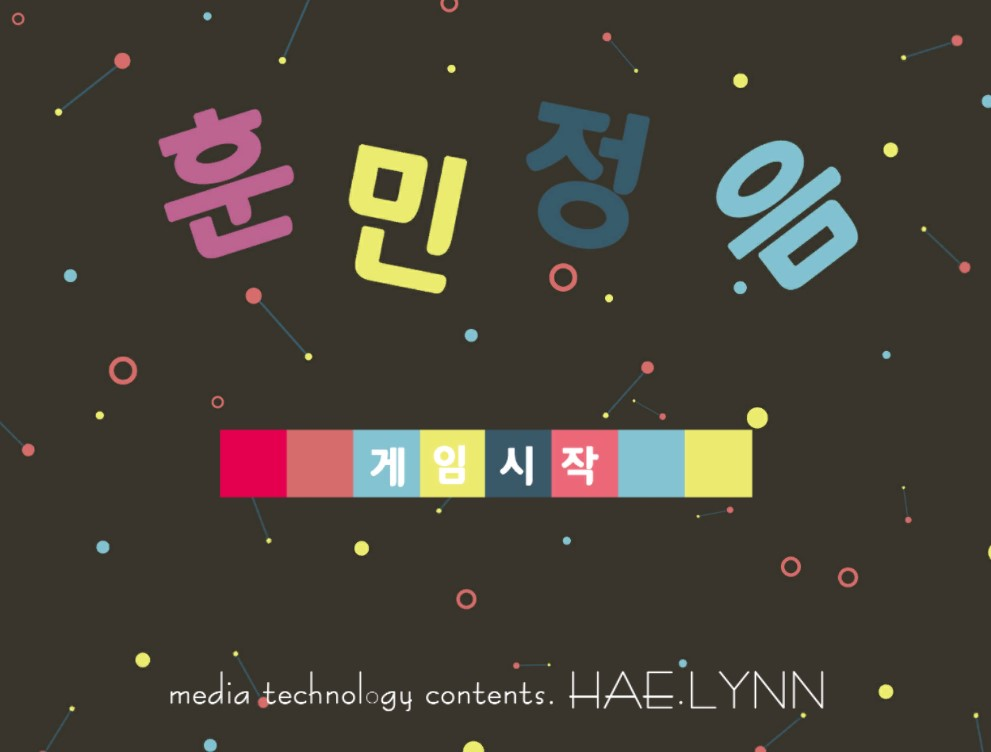
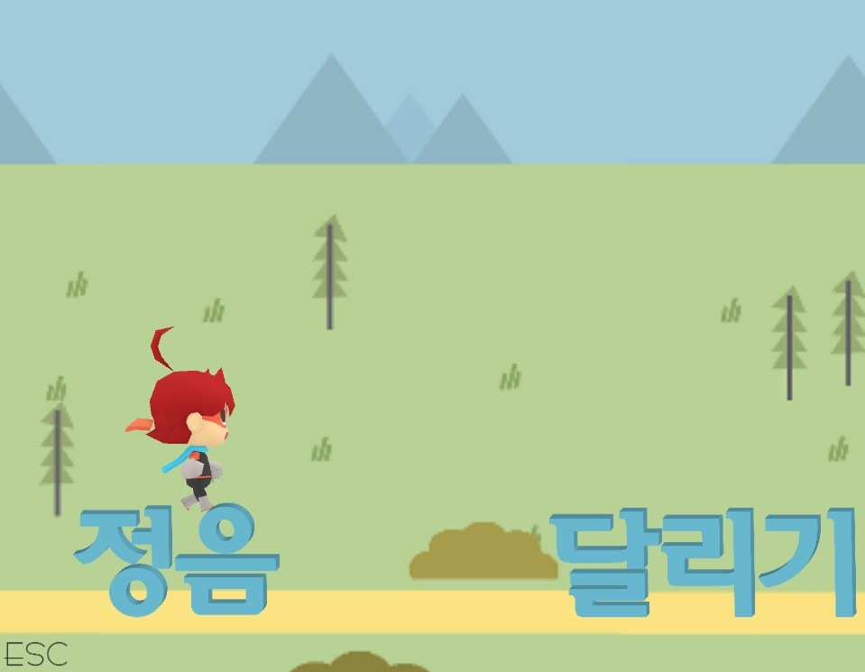
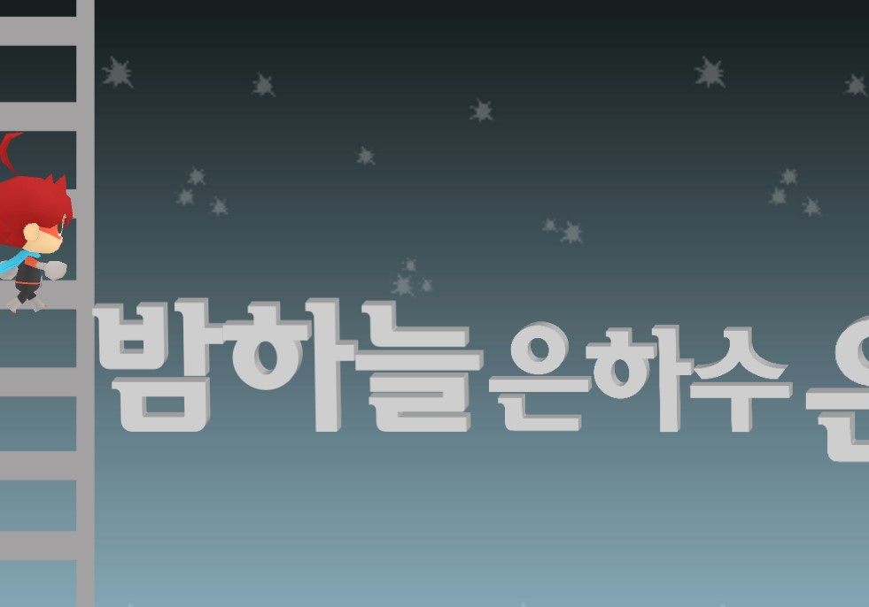
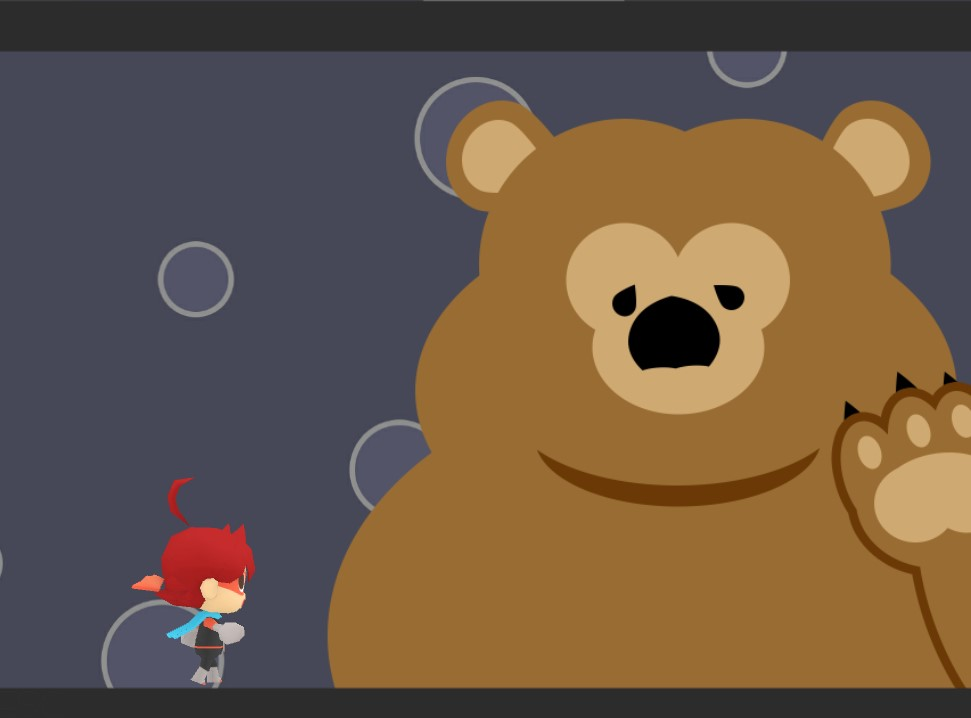

# gameprogramming2016
2016 가톨릭대학교 게임프로그래밍 대회 동상 _ 유니티 게임 제작 &lt;훈민정음>(개인프로젝트)

### 개발환경
- 운영체제 : window10
- 개발언어 : 유니티, C#
- 스테이지 디자인 : 어도비 포토샵, 어도비 일러스트레이터, MS 파워포인트
- 캐릭터 디자인 : &lt;유니티게임 제작입문> 교재제공 3D캐릭터 유니토 사용
- 제작 : 2015년 2학기 약 1

### 기획의도
우연히 영어 낱말을 조합한 게임을 하게 되었는데 한국어의 특이한 모양이나 특징들을 활용하면 더 재미있는 게임을 만들 수 있을거라 판단하여 &lt;훈민정음> 게임을 만들게 되었습니다.
 저는 게임을 즐기기는 하지만 잘하는 편이 아니었기 때문에 어린아이들이나 여자, 노인 등 게임을 잘하지 못 하는 사람도 부담없이 즐길 수 있도록 공략/전략 게임의 플랫폼을 사용하여 생명력이 닳지 않는 스테이지를 깨는 게임으로 만들게 되었습니다. 이로 캐릭터가 죽는다는 부담없이 누구나 게임의 스테이지를 깨며 즐길 수 있을 것입니다. 아쉬운 점이 있다면 제작 시간이 부족하여 생각했던 다양한 장애물을 모두 구현하지 못한 것입니다.
 
 ### 간단 시나리오
 - 유니코가 한글로 이루어진 세상을 누비다 달나라로 여행을 떠나게 된다.
 
 ### PREVIEW
 게임 시작 대기 화면
 
 
 
 게임 플레이 화면
 
 
 
 
 
 가장 공들인 구글 이미지를 참고하여 직접 만든 곰입니다
 
 
 
 ### 자세한 공략은 게임소개서.docx에서 확인할 수 있습니다.
 ### Hunminjeongum.exe 파일을 받으면 실제 게임을 플레이할 수 있습니다.
